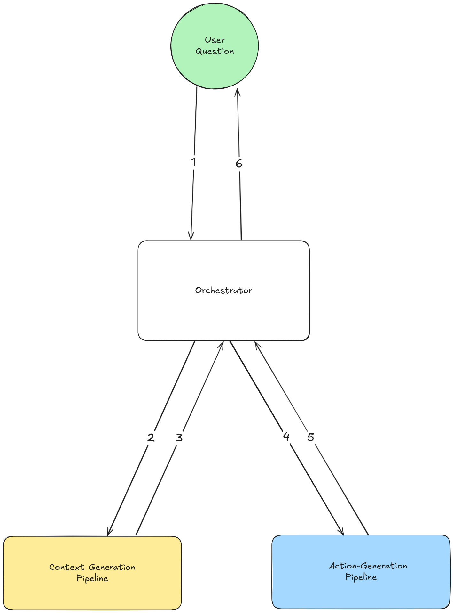

# Financial Report Document Parsing


## Table of Contents

1. [Introduction](#introduction)
2. [Methodology & Architecture](#methodology--architecture)
3. [Prototype Focus](#prototype-focus)
4. [Implementation & Evaluation](#implementation--evaluation)
5. [Limitations & Future Work](#limitations--future-work)

## Introduction

This document outlines the choices made and motivations behind the components of the document parsing system. It also provides a critical analysis of the system's performance and limitations and suggests potential improvements.

## Methodology & Architecture

The brief for this project was to create a system that can answer a variety of questions from a user regarding a financial report. The system should be able to handle a wide range of financial reports and extract information from them in a consistent and accurate manner. It should also utilise LLMs.

The dataset to be used for the system is the training set associated with the [ConvFinQA](https://arxiv.org/abs/2210.03849) paper. Each training example contains:
- Manually curated excerpts from financial reports, each containing a table and the the text surrounding it.
- One or two questions relating to the excerpts. The questions all require some simple mathematical calculations to produce an answer.
- The expected answer and the 'program' required to produce the answer, provided as a parseable snippet of pseudocode.


### Initial Investigation & Results

A basic agent was implemented to generate candidate programs in the same format as the ConvFinQA dataset using a single. Data was presented to the agent in the form:

```
Pre-text:

...  (The text on the page before the table)

Table:

... (The table, presented as a list of rows, each row being a list of cells)


Post-text:

... (The text on the page after the table)

Question:

... (The user question)
```

In the case where multiple questions were provided, the agent was granted access to the results of the previous question.

A second agent with multimodal capabilities was implemented and provided with a screenshot of the report page instead of text data. This agent was less reliable than the first, often mixing up information from different sections of the page.

### Prototype Focus

The text-based agent performed very well, with a large majority of the questions being answered correctly. However, it was reliant on the data being provided to it correctly. For the initial paper, the data was curated by human experts. However, for a real-world application, this would not be possible.

The focus of this prototype was to develop a system capable of automatically extracting the table and text data from a PDF report, and using the text-based agent to generate the candidate programs. In a fully productionised system, the context extraction pipeline would likely be run offline and indexed with the results being stored in a knowledge base and accessible later with a RAG-style workflow.

The basic architecture is shown below:



In order, the system:

1. Takes a user message specifying a PDF URL, the page and the question to answer.
2. Sends the PDF URL and page number to the context generation pipeline. The context generation pipeline retrieves
the PDF page analyzes it and splits it into sections (text vs. table vs graph). For graph data, a cropped image of the graph is extracted. 
For table data, the table is extracted using the tabula library. Any text data is extracted using the PyMuPDF library.
3. The context generation pipeline sends the extracted data back to the orchestrator.
4. The orchestrator sends the extracted data to the action generation pipeline, along with the user question(s).
5. The action generation pipeline generates the candidate program and returns the answer to the orchestrator. 
6. The orchestrator replies to the user with the answer.


## Implementation & Evaluation

The prototype was built using the [agno](https://github.com/agno/agno) framework. Pipelines were implemented as agno workflows
instead of using general agent 'teams'. This was done to provide fine control over agent execution, for better control of data flow (including state, caching, etc.) and for easier debugging.

Basic Sqlite storage was used for workflow state. In a production system, this should be replaced with something more robust. The state should be used to store the results of the pipeline, along with any intermediate results to enable debugging, caching and generation of few-shot examples for iterative improvement of the system.

Structured output was used where possible to ensure agent output and make integration with the various components easier.

### Context Generation Pipeline

Two agents were used to generate the context for the document. The first was a content summarizer, which was used to categorise the various sections of the document into one of text, table or graph. It was provided an image of the PDF page as input. The second agent was a bounding box inspector, which was used to generate the bounding boxes for the various sections of the document. It was provided with an image of the PDF page and a section description provided by the content summarizer and was made to iteratively generate bounding boxes for the section until it was satisfied with the result.


The content summarizer was evaluated on a small sample from the ConvFinQA dataset. Evaluations were carried out using a custom evaluation script, with an agent checking the results against the full page image. It received a score of 1 if it correctly categorised all the sections and 0 otherwise. The average score received was 0.7.

An example script is provided in the evaluations directory.

The bounding box inspector was evaluated on an extension of the ConvFinQA dataset. A small sample was chosen and categorised according to the correct content types (as would be produced by the content summarizer). The bounding box inspector was then judged on the accuracy of the bounding boxes it produced. If the content within the box matched the curated content as defined by ConvFinQA, it was judged as correct.


### Action-Generation Pipeline

The action generation pipeline consisted of the same text-based agent mentioned earlier, with a slight modification to allow for analysis of images (in the case where graphs appeared on a page). The results are discussed above. Due to the time cost associated with curating novel questions involving graphs (as the ConvFinQA dataset did not include any), these examples were not included in the evaluation.


## Limitations & Future Work

The prototype currently has a number of limitations, including:

- Long processing times - the system processese PDF pages on-demand to extract the various sections. This should be done offline, with the results being stored in a knowledge base and accessible later with a RAG-style workflow.
- Difficulty in extracting data from image-based PDF files. This could be addressed by a combination of using OCR for text data and extracting tabular data as images.
- Lack of flexibilty - the user has to specify the page number and PDF URL that they want to extract data from. This could be addressed by a separate pipeline that indexes the PDF and makes the results accessible later with a RAG-style workflow.